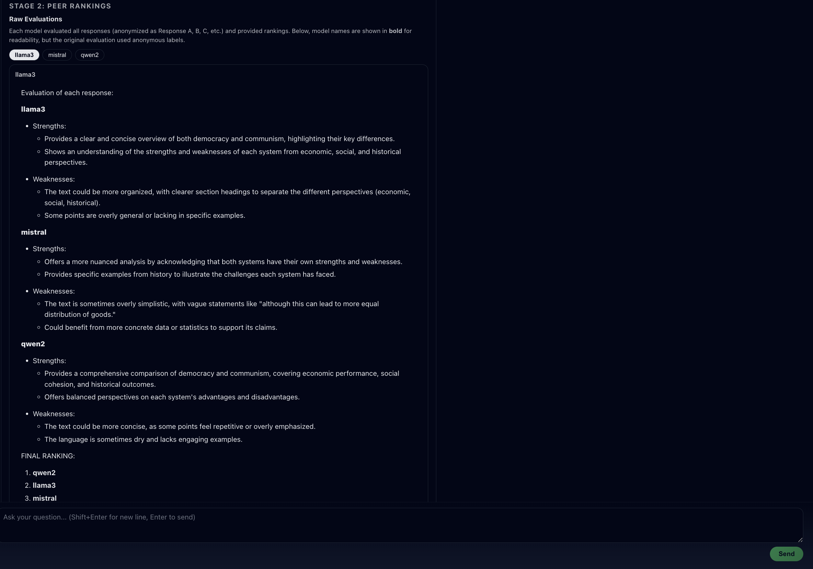
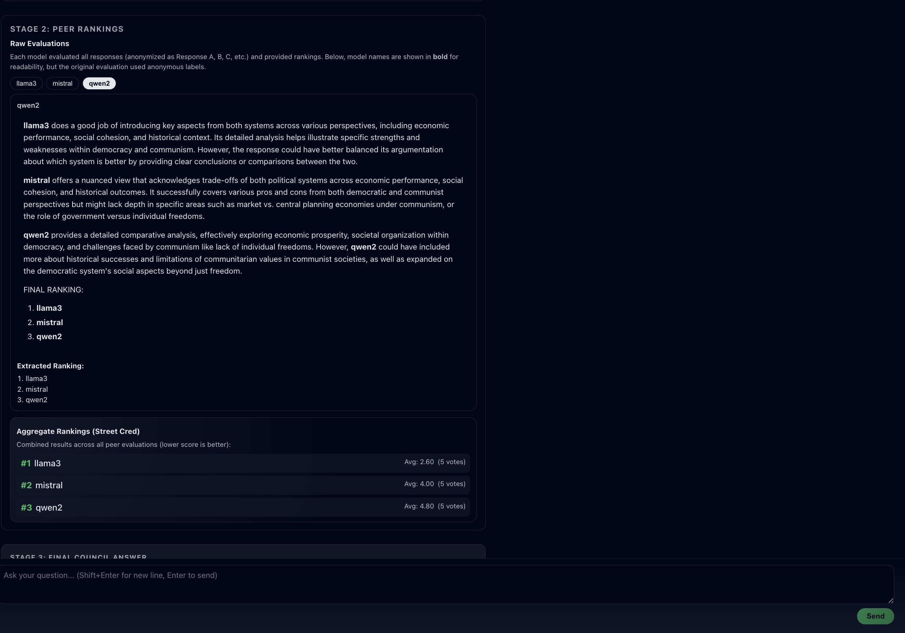
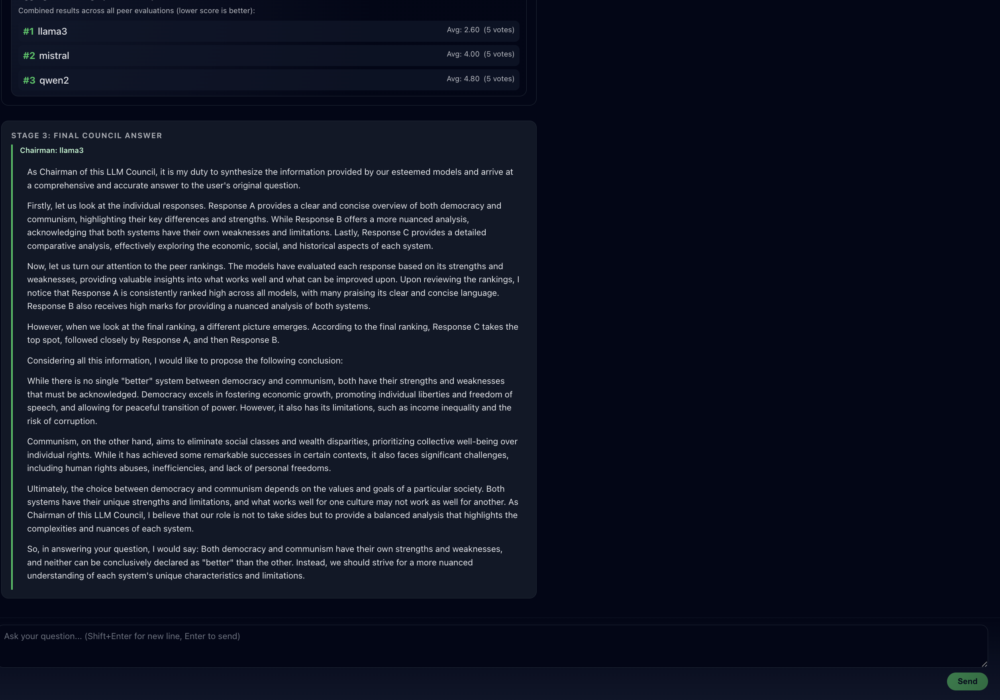

# LLM Council


LLM Council is a **local multi-LLM evaluation platform**.  
Instead of asking a single model, you ask a *council* of models that:

1. Answer independently  
2. Critique and rank each other (anonymized)  
3. Produce a final synthesized answer via a Chairman model  

The UI resembles ChatGPT, but the backend runs a structured **multi-agent evaluation pipeline**.

---

## How It Works

### Stage 1 - Individual Responses
Each model answers the user query independently.  
Responses are displayed in a tabbed interface.


---

### Stage 2 - Peer Evaluation & Ranking
Each model reviews the other responses (anonymized as A / B / C)  
and ranks them based on quality and insight.




---

### Stage 3 - Final Council Answer
A designated Chairman model synthesizes the best ideas into  
a single final response.



---

## Tech Stack

- **Backend:** FastAPI (Python), async execution
- **Frontend:** React + Vite
- **LLMs:** Ollama (local models)
- **Streaming:** Server-Sent Events (SSE)
- **Storage:** Local JSON conversation files

---

## Setup

### 1. Install Dependencies

#### Backend (uv)
```bash
uv sync
Frontend (npm)

```bash
cd frontend
npm install
cd ..

## 2. Start Ollama & Download Models
Install Ollama:

```arduino
https://ollama.com
Pull models:

```bash
ollama pull llama3
ollama pull mistral
ollama pull qwen2
Start the Ollama server:

```bash
ollama serve
3. Configure Models (Optional)
Edit backend/config.py:

```python
COUNCIL_MODELS = [
    "llama3",
    "mistral",
    "qwen2",
]

CHAIRMAN_MODEL = "llama3"
Running the Application
Option 1 - Use the start script

```bash
./start.sh

Option 2 - Run manually
Terminal 1 (Backend)

```bash
uv run python -m backend.main
Terminal 2 (Frontend)

```bash
cd frontend
npm run dev
Open in your browser:

```arduino
http://localhost:5173
